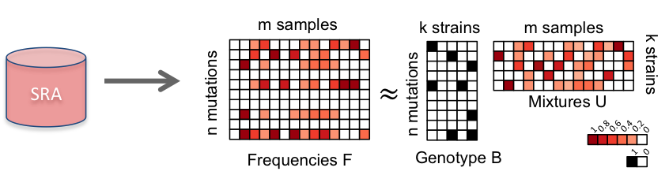

# Characterization of SARS-CoV-2 viral diversity within and across hosts

In light of the current COVID-19 pandemic, there is an urgent need to accurately infer the evolutionary and
transmission history of the virus to inform real-time outbreak management, public health policies and mitigation strategies. Current phylogenetic and phylodynamic approaches typically use consensus sequences,
essentially assuming the presence of a single viral strain per host. This code takes as input the variant allele frequencies of the mutations in multiple samples collected from infected hosts and finds the genotypes and proportions of the strains present in the hosts.



In the STRAIN DECONVOLUTION problem, we are given the variant allele frequency (VAF) matrix F, containing the VAF of every mutation in each sample, and a number k of strains to be inferred. Our goal is to infer the genotype matrix B and mixture matrix U such that F ≈ BU, thus elucidating strains that occur within and across COVID-19 hosts along with their sample-specific proportions.

## Contents

  1. [Compilation instructions](#compilation)
     * [Dependencies](#dep)
     * [Compilation](#comp)
  2. [Usage instcructions](#usage)
     * [I/O formats](#io)
     * [Simulation](#simulate)
     * [Deconvolution](#gradient)
     * [Exposure](#exposure)

<a name="compilation"></a>
## Compilation instructions

<a name="dep"></a>
### Dependencies

Deconvolution solver is written in C++11 and requires a modern C++ compiler
(GCC >= 4.8.1, or Clang). In addition it has the following dependencies

* [CMake](http://www.cmake.org/) (>=3.1)
* [Boost](http://www.boost.org) (>= 1.38)
* [LEMON](http://lemon.cs.elte.hu/trac/lemon) graph library (>= 1.3)
* [Eigen](http://eigen.tuxfamily.org/) (>= 3.3.7)
* [LBFGS++](https://lbfgspp.statr.me/) (>= 1.8.17)
* [GUROBI](https://www.gurobi.com/) (>= 8.1.0)

<a name="comp"></a>
### Compilation

To compile execute the following commands from the root of the
repository

    $ mkdir build
    $ cd build
    $ cmake ..
    $ make

In case CMake fails to detect LEMON, run the following command with adjusted paths:

    $ cmake -DLIBLEMON_ROOT=~/lemon

The compilation results in the following files in the `build' directory

EXECUTABLE       | DESCRIPTION
-----------------|-------------
`simulate`       | simuate perfect mixture data with missing entries for input
`gradient`       | solve strain deconvolution problem using penalty thresholding approach
`exposure'       | for a given set of strains, find the strain proportions in the sample

<a name="usage"></a>
## Usage instructions

<a name="io"></a>
### I/O formats

The SharpTNI input is text based. There are two input files, the reference allele count file and the alternate variant allele count file.
Each line in both files correpsonds to a position in the genome.
Both the files should be tab-seperated.
The first 10 columns of the file have information about the mutations and its presence in the SRA and GISAID sequences. Only the position information is used in the algorithm to identify the mutation and the rest of the columns can be left empty.
The first 10 columns in the input files are --- '\<position\> \<reference allele\> \<variant allele\> \<gene\> \<N/S (nonsynonymous/synonymous)\> \<Amino acid change\> \<number of subclonal SRA samples\> \<number of clonal SRA samples\> \<total number of SRA samples\> \<number of consensus sequences\>'.

Example:

```
./deconvolve -k 20 ../../data/final_ref_results.tsv ../../data/final_alt_results.tsv -o lol -N 100
```
